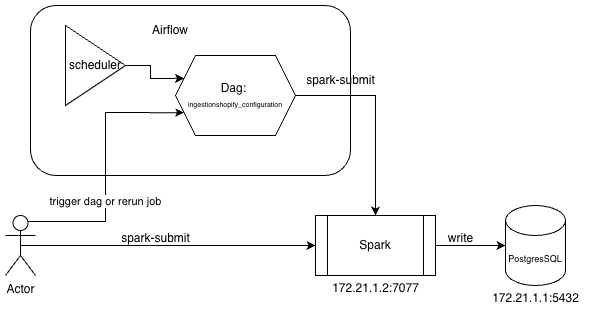

# XXX Assignment

---

## Prepare local env

### Pyenv: managing python and virtual env

- install pyenv: `curl https://pyenv.run | bash`
- install python: `pyenv install  3.12.5` 
- create virtual env with pyenv: `pyenv virtualenv 3.12.5 xxx-venv`

---

### Poetry: managing dependencies

- install poetry: `pip install poetry`
- deactive auto creation of virtual env: `poetry config virtualenvs.create false` use `--local` if you wish. \
This step is optionnal if we are already in xxx-venv since we are already in venv.
- intall all depencency `poetry install`

### Docker

- install docker: ref to https://docs.docker.com/engine/install/

## Infrastructure

- I will be good to have a IaC to manage our infra resource. \
So I just provide a simple example structure using terraform and using terragrunt. \ 
Let's discuss this part to fill the content. Note that can also be Ansible playbook.

## Code structure

- `./dags`: airflow dags python file
- `./etl`: pyspark python file workflow to process the data
- `./terraform`: IaC code, should be in dedicated project
- `./github`: codeownners and CI/CD
- `./config`: airflow varibale used by the dag
- `./tests`: unit test

## Structure

## Run with Airflow

### Prerequisites

1. `make build` to build airflow and spark image
2. `make init` to init airflow
3. `make up` to create airflow and spark container
4. `make package-project` to create the zip that contain `etl` code to be use when we call `spark-submit`
5. trigger `ingestion_shopify_configuration` dags with the date
6. `make down` if you want to shutdown all

### Setup in Airflow UI
- import `config/airflow_variable.json` to Airflow Variable
(with your `AWS_ACCESS_KEY_ID` and `AWS_SECRET_ACCESS_KEY`)
- create a connection (id:`spark_default`, type:`Spark`, host:`spark://172.21.1.2`, port:`7077`, mode:`client`, binary:`spark-submit`)

### Run
I have create `ingestion_shopify_configuration` dag  scheduled at 3am every day to run the pipeline. \
But is also possible to trigger it manualy with the date in param.

## Run by call directly docker in terminal
### Prerequisites
1. `make build-spark` to build airflow and spark image
2. `make up-spark` to create airflow and spark container
3. `make package-project` to create the zip that contain `etl` code to be use when we call `spark-submit`
4. `docker exec -it agoliaassignment-spark-1 spark-submit --master spark://172.21.1.2:7077 etl/process_shopify_configuration.py` \
and with extra spark cluster setting.
5. `make down-spark` if you want to shutdown all

## Development flow
### Gitflow
- https://nvie.com/posts/a-successful-git-branching-model/

## Good to know
- Spark UI: `http://localhost:8090/`

## Open questions:

- Rerun/backfill/idempotent: \
We can rerun the job of related day in airflow or we can call with docker. \
The thing that we need to know is for now, the pipeline is not idempotent, \
wich mean run with the same date with cause in our table duplicate row. \
We can discuss this topic to handle this situation.

- Monitoring:
The currrent version didn't have any monitoring module except to look at the dag run status. \
We know monitoring is crucial for data pipeline. \
There are many way to do the metric collect and alerting to monitor and take action ASAP.

- Scale in higher data volumes:
Using spark make the fundation to handle higher data volume, \
and I chose to externalise the compute part to be more flexible can scale up.

- CI/CD
Thus, CI/CD is crucial part of development life circle. \
By combine with gitflow model, it can boost the efficacity and the code quality. \
For example on feature branch to run lint and unit test or trigger with a tag the package and publish action. \
As long as it can help on our productivity, we can add many thing inside.

- End to end test / ingetration test
In data, even if we have unit test for our transformation, is not enough. \
Testing our pipeline from A to Z is a hard thing but not a impossible mission. \
Maybe we didn't need to test every pipeline but it definitely worth the case.
